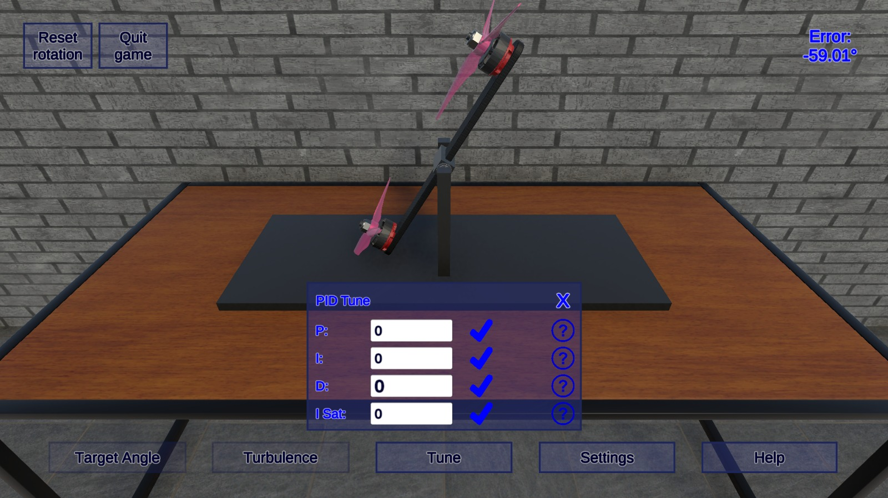
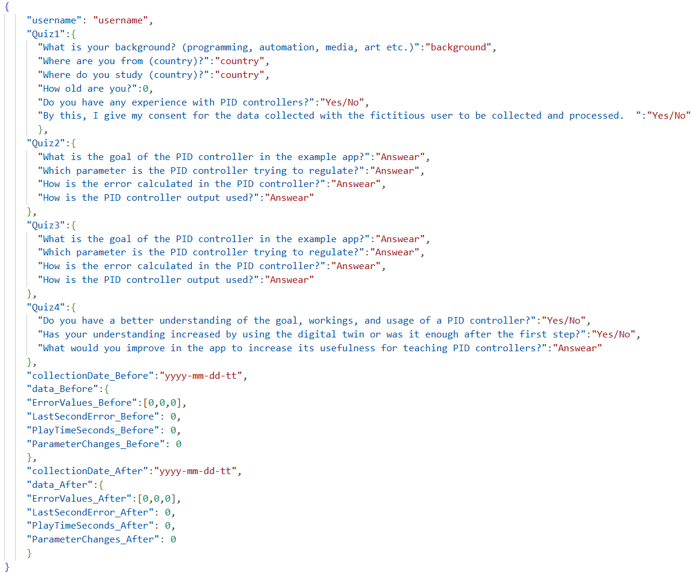

# OneAxisDrone-OpenRepository
Open repository supporting the scientific paper called: A Digital-Twin Serious Game for PID Controller Education: One-Axis Drone Model, Analytics, and Student Study

**Overview**
Our research presents a serious game built around a one-axis drone digital twin to support teaching PID controllers. The serious game logs error values at 10 Hz, along with interaction metrics for enabling instructors to diagnose common tuning issues directly from plots generated from the collected errors. A within-subjects study was performed on data collected from 21 students, with error traces yielding clear, actionable feedback patterns. Unsupervised play sessions showed no measurable quiz or error gains, but the second attempt showed that reduced effort was needed to tune the PID controller to the same performance. All data was collected anonymously from the beginning. Different sources were merged and the resulting JSON file was released along with Python scripts for generating plots and all relevant plots which have been generated by the script. Overall, the proposed serious game has emerged as a safe and cost-efficient teaching aid that complements instruction and bridges the gap between theory and practice.

**Gameplay**
Players should open the tune panel and attempt to tune the PID controller of the one-axis drone by adjusting KP, KI, KD and ISat. When satisfied with the tune, turbulence balls can be spawned by pressing SPACE to observe the behavior of the system when influenced by external forces.

**Requirements**
The work was conducted using Python 3.11.3 for a full list of requirements to run it see `requirements.txt`.

**Usage**
Clone the repo and run the script `p1.py`.
`git clone <your_repo_url>`
`cd <repo_name>`
`pip install -r requirements.txt`

Make sure that, on the line 
`comparer = JSONMultiErrorComparer("All_B.json", "All_A.json", label1="Before", label2="After")`
you specify the desired JSON files.

Run the script `p2.py`.

Make sure that, on the line
`preparer = JSONDataPreparer("All_A.json")`
you specify the desired JSON file.

